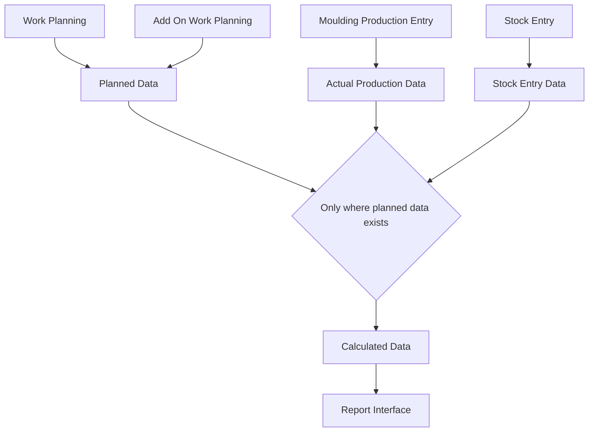

# Updated Data Architecture Flow: Planned vs Actual Production Report

## 1. Data Sources

### Planned Production Data
- **Work Planning** (`tabWork Planning` + `tabWork Plan Item`)
  - Status: Both Draft (docstatus=0) and Submitted (docstatus=1)
  - Key fields: date, shift_type, item, target_qty, mould
  - Planning source identified as: "Work Planning"

- **Add On Work Planning** (`tabAdd On Work Planning` + `tabAdd On Work Plan Item`)
  - Status: Both Draft (docstatus=0) and Submitted (docstatus=1) 
  - Key fields: date, shift_type, item, target_qty, mould
  - Planning source identified as: "Add On Work Planning"

### Actual Production Data
- **Moulding Production Entry** (`tabMoulding Production Entry`)
  - Status: Only Submitted documents (docstatus=1)
  - Key fields:
    - moulding_date (→ production_date)
    - item_to_produce (→ item_code)
    - scan_lot_number (→ lot_number) *[UPDATED]*
    - batch_no (fallback for lot_number)
    - number_of_lifts
    - no_of_running_cavities
  - Formula for pieces: number_of_lifts × no_of_running_cavities

- **Stock Entry** (`tabStock Entry` + `tabStock Entry Detail`)
  - Status: Only Submitted documents (docstatus=1)
  - Purpose: Only "Manufacture" entries
  - Used for: Stock entry references and count only
  - Only shown if it matches planned production

## 2. Data Flow

## 3. Key Entity Relationships

### Primary Key Structure
- Records are uniquely identified by composite key:
  `production_date | item_code | lot_number`

### Relationship Mapping
- Work Planning item ↔ Actual Production item:
  - Matched by: date + item_code
  - *Note: No direct lot number matching since planned data doesn't have lot numbers*

- Actual Production ↔ Stock Entry:
  - Matched by: date + item_code + lot_number

## 4. Data Transformation Logic

### 1. Initial Data Collection
- **Collect planned data**:
  - Get data from Work Planning and Add On Work Planning
  - Include both draft and submitted documents
  - Calculate planned pieces based on shift type and mould specifications

- **Collect actual production data**:
  - Get data from Moulding Production Entry
  - Calculate actual pieces produced (number_of_lifts × no_of_running_cavities)
  - Group by date, item, and scan_lot_number *[UPDATED]*

- **Collect stock entry data**:
  - Get references to Stock Entry documents
  - Group by date, item, and lot number

### 2. Data Integration Process
- **Start with planned data only**:
  - Create initial records based on planned production only
  - Each record has: date, item, source, planned quantity
  - *No unplanned production will be shown*

- **Add actual production data**:
  - Only update records that have planning data
  - Match by date + item + lot_number (when possible)
  - Add actual production quantities and references

- **Add stock entry data**:
  - Only update records that have planning data
  - Match by date + item + lot_number
  - Add stock entry references

### 3. Calculations
- **Variance Calculation**:
  - variance_pieces = actual_qty_pieces - planned_qty_pieces
  - variance_percentage = (variance_pieces / planned_qty_pieces) × 100

- **Status Determination**:
  - "Target" when efficiency = 100%
  - "Under" when efficiency < 100%
  - "Over" when efficiency > 100%

## 5. Filtering System

- **Date Range Filter**: Filters all data sources by date
- **Item Filter**: Filters by item code
- **Lot Number Filter**: Filters by scan_lot_number *[UPDATED]* or batch_no
- **Shift Filter**: Filters by shift type
- **Planning Filter**:
  - "All": Shows all planned records (default)
  - "Planned": Shows only records with planned quantities > 0

## 6. Key Changes in Latest Update

1. **Removed "Produced After Rejection" Column**
   - Removed all references to stock_qty_pieces
   - Simplified the actual production tracking

2. **Switched to scan_lot_number for Lot Tracking** *[UPDATED]*
   - Now using scan_lot_number instead of spp_batch_number for tracking lots
   - More accurate representation of production batches

3. **Only Showing Planned Production**
   - No more "No Planning" entries
   - Report focuses exclusively on planned vs. actual comparison

4. **Including Draft Planning Documents**
   - Both draft (docstatus=0) and submitted (docstatus=1) planning documents
   - Better visibility into planning pipeline
